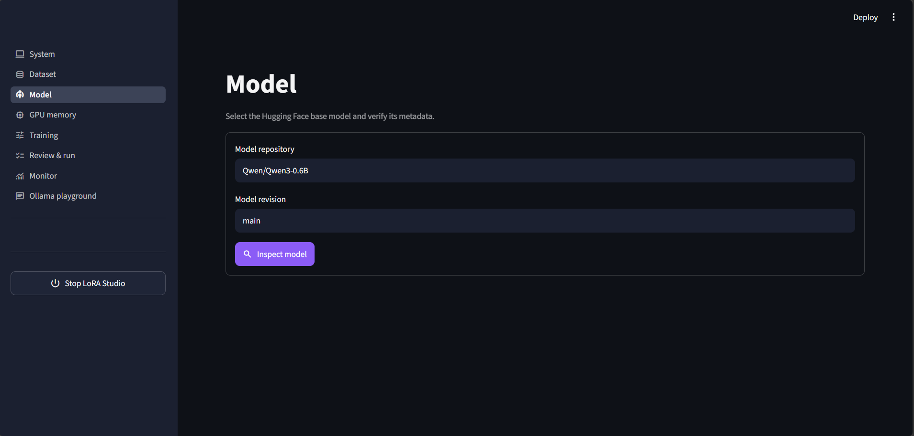

# LoRA Fine-tune Studio

[](https://github.com/pypi-ahmad/lora-qlora-fine-tuning-app/actions/workflows/ci.yml)
[](https://github.com/pypi-ahmad/lora-qlora-fine-tuning-app/releases)
[](LICENSE)

A local, guided Streamlit application for parameter-efficient LLM post-training on NVIDIA GPUs.
Prepare datasets, configure a supported recipe, train an adapter, monitor the run, and compare the
result with the base model from one interface.

> [!NOTE]
> LoRA Fine-tune Studio is designed for local, single-user learning and experimentation. It is not
> a hosted training service or a multi-user production platform.

The current release is [v0.5.1](https://github.com/pypi-ahmad/lora-qlora-fine-tuning-app/releases/tag/v0.5.1).
It documents the read-only showcase and the portable tutorial checks. Training behavior is unchanged
from v0.5.0. See [CHANGELOG.md](CHANGELOG.md).

## Interactive showcase

[](demo/streamlit_app.py)

The deployment-ready showcase presents the dataset, configuration, review, and monitor workflow
with synthetic fixtures. It is read-only: it performs no training, model downloads, uploads,
network requests, or persistence.

Run the lightweight showcase without installing the CUDA training stack:

```powershell
uvx --from streamlit==1.61.1 streamlit run demo/streamlit_app.py
```

The same command works in Bash after `uv` is installed.

For Streamlit Community Cloud, select `main`, `demo/streamlit_app.py`, and Python 3.12. The
entrypoint-local `demo/requirements.txt` installs only Streamlit. No secrets are required.

## Highlights

- Guides users through system checks, dataset preparation, model inspection, training, monitoring,
  and adapter review.
- Combines multiple Hugging Face or uploaded CSV, JSON, and JSONL datasets in one deterministic
  training run.
- Validates conversational, text, prompt/completion, and paired-preference schemas before training.
- Provides Smoke test, Standard, and High quality presets with optional controls for learning rate,
  epochs, sample limits, gradient norm, precision, sequence length, and batching.
- Queues multiple training configurations while one isolated GPU worker runs, with live logs,
  cancellation, checkpoint recovery, and automatic FIFO continuation.
- Supports optional native Windows acceleration through a repository-managed Unsloth Core runtime.
- Saves portable PEFT adapters locally and can optionally upload completed adapters to the
  Hugging Face Hub.
- Includes base-versus-adapter comparison and a separate playground for models already installed
  in Ollama.
- Ships a CUDA-free, read-only Streamlit showcase for reviewers who only need to inspect the
  guided workflow.

## Training support

| Approach | Expected dataset |
| --- | --- |
| Supervised Fine-Tuning | Conversations, plain text, or prompt/completion pairs |
| Reward Modeling | Prompt with chosen and rejected responses |
| DPO Training | Prompt with chosen and rejected responses |
| KTO Training | Prompt with chosen and rejected responses |
| ORPO Training | Prompt with chosen and rejected responses |

| Approach | LoRA | QLoRA | OFT | QOFT |
| --- | :---: | :---: | :---: | :---: |
| Supervised Fine-Tuning | ✅ | ✅ | ✅ | ✅ |
| Reward Modeling | ✅ | ✅ | ✅ | ✅ |
| DPO Training | ✅ | ✅ | ✅ | ✅ |
| KTO Training | ✅ | ✅ | ✅ | ✅ |
| ORPO Training | ✅ | ✅ | ✅ | ✅ |

PPO is not implemented. Native Unsloth acceleration is available on Windows for LoRA and QLoRA;
OFT and QOFT use the standard PEFT/TRL backend.

## Workflow

1. **System** — verify the operating system, CUDA GPU, memory, storage, and integrations.
2. **Dataset** — inspect, map, and combine compatible local or Hugging Face datasets.
3. **Model** — inspect the base model and estimate whether it fits the available VRAM.
4. **GPU memory** — review live CUDA use and release unused PyTorch cache when safe.
5. **Training** — select the approach, adapter method, backend, preset, and optional overrides.
6. **Review & run** — validate the configuration, then start it or add it to the durable queue.
7. **Monitor** — inspect queue order, progress bar and percentage, logs, metrics, cancellation, and
   recovery.
8. **Ollama playground** — chat with models already served by a local Ollama installation.

## Requirements

- Native Windows 11 or x86-64 Linux
- NVIDIA CUDA-capable GPU with a CUDA 13-compatible driver
- At least 6 GB VRAM recommended
- Git and internet access for initial setup and model downloads
- Hugging Face token only for gated/private repositories or Hub uploads

The interface can open without a GPU, but training and adapter comparison require CUDA. See the
[complete setup guide](SETUP.md) for driver requirements, dependencies, disk recommendations,
manual installation, and troubleshooting.

## Quick start

Clone the repository:

```bash
git clone https://github.com/pypi-ahmad/lora-qlora-fine-tuning-app.git
cd lora-qlora-fine-tuning-app
git checkout v0.5.1
```

Omit the checkout to follow `main`. Use the tag when you want the published v0.5.1 tree.

Launch on Windows:

```powershell
& ".\Launch LoRA Studio.cmd"
```

Launch on Linux:

```bash
bash "Launch LoRA Studio.sh"
```

The platform launcher installs `uv` when needed, prepares the locked project environment, starts
Streamlit in the background, and opens <http://localhost:8504>. On Windows it also prepares the
isolated Python 3.13 Unsloth runtime.

For manual setup, token configuration, update instructions, and a full dependency inventory, read
[SETUP.md](SETUP.md).

## First smoke test

1. Confirm the readiness checks on **System**.
2. Upload `examples/sft_sample.jsonl` on **Dataset**, inspect it, and select **Add dataset**.
3. Inspect `Qwen/Qwen3-0.6B` on **Model**.
4. Select **Supervised Fine-Tuning**, **QLoRA**, and **Smoke test** on **Training**.
5. On Windows, optionally enable **Use Unsloth** after the runtime reports ready.
6. Validate the configuration on **Review & run**, then start training.
7. Follow the run on **Monitor** and find the adapter under
   `.runs/<run-id>/output/adapter`.

The Smoke test preset verifies that the pipeline works; it is not intended to produce a
production-quality adapter.

## Documentation

| Document | Purpose |
| --- | --- |
| [Setup guide](SETUP.md) | Windows, Linux, dependencies, verification, and troubleshooting |
| [Usage guide](USAGE.md) | Complete application workflow, showcase, and operational guidance |
| [Read-only showcase](demo/streamlit_app.py) | CUDA-free Streamlit walkthrough of dataset, configure, review, and monitor |
| [Technical reference](TECHNICAL.md) | Architecture, contracts, lifecycle, storage, and extension points |
| [Zero-to-Mastery course](TUTORIAL.md) | Canonical NLP, transformer, fine-tuning, labs, evaluation, and capstone curriculum |
| [Interactive handbook](docs/index.html) | Searchable multipage course for local reading or GitHub Pages |
| [PDF handbook](docs/downloads/lora-finetune-studio-zero-to-mastery.pdf) | Complete 50-page course for offline reading |
| [Contributing guide](CONTRIBUTING.md) | Development workflow, checks, and pull-request requirements |
| [Security policy](SECURITY.md) | Security model and private vulnerability reporting |
| [Support](SUPPORT.md) | Where to ask usage questions and what response time to expect |
| [Disclaimer](DISCLAIMER.md) | Data and model responsibility, no warranty, no financial support wanted |
| [Changelog](CHANGELOG.md) | User-visible release history |

## Project boundaries

- PPO, full tuning, freeze tuning, pre-training, and distributed training are not implemented.
- Native Unsloth integration currently targets Windows; Linux uses the standard backend.
- Only one local training job runs at a time; additional jobs wait in the persistent FIFO queue.
- The application has no authentication and must not be exposed to an untrusted network.
- The Ollama playground does not merge, convert, or import trained adapters.
- GitHub Pages and Streamlit Community Cloud cannot access a user's local GPU or Ollama service.

## Help and contributing

This project is free, open-source, and community-driven. Cloning, running, testing, filing bugs,
suggesting features, and sending pull requests are all welcome.

Use [GitHub Issues](https://github.com/pypi-ahmad/lora-qlora-fine-tuning-app/issues) for reproducible
bugs and focused feature requests. Before contributing, read [CONTRIBUTING.md](CONTRIBUTING.md) and
the [Code of Conduct](CODE_OF_CONDUCT.md). For usage questions, see [SUPPORT.md](SUPPORT.md).

Do not publish vulnerabilities or credentials in an issue. Follow [SECURITY.md](SECURITY.md) for
private vulnerability reporting.

> [!NOTE]
> This project does not want or accept donations, sponsorships, or any other financial support, and
> never will. It's free to use and free to modify. If you'd like to give back, the most valuable
> thing you can do is contribute code, tests, docs, or a well-written bug report.

## You run it — you own the risk

You run this application on your own machine with your own Hugging Face token. All data and models
you upload, download, train on, or push to the Hugging Face Hub are 100% your own responsibility —
see [DISCLAIMER.md](DISCLAIMER.md) for the full terms and [SECURITY.md](SECURITY.md) for the trust
boundaries this application crosses.

## License

[MIT](LICENSE) © 2026 Ahmad Mujtaba.
