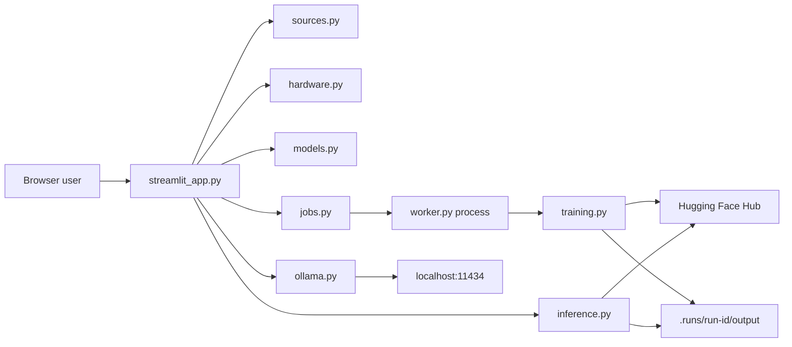
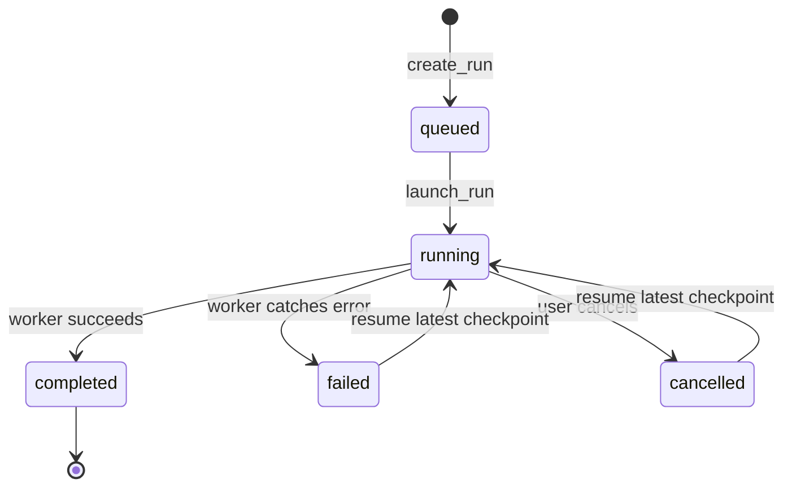

# Technical Reference

This document describes the implemented architecture of LoRA Fine-tune Studio `0.1.x`. For
operating instructions, see [USAGE.md](USAGE.md). For contribution requirements, see
[CONTRIBUTING.md](CONTRIBUTING.md).

## Goals and boundaries

The project provides a transparent local workflow for supervised parameter-efficient fine-tuning.
It favors inspectable files and one worker process over databases, queues, or hosted services.

Implemented:

- supervised fine-tuning with TRL `SFTTrainer`;
- LoRA and four-bit QLoRA adapters for causal language models;
- Hugging Face or uploaded datasets;
- one durable local training job;
- checkpoint cancellation and resume;
- local base-versus-adapter comparison; and
- an independent Ollama playground.

Not implemented:

- DPO, RLHF, RLAIF, reward modeling, or distributed training;
- CPU training or multi-GPU orchestration;
- multi-user access, authentication, quotas, or remote job execution;
- model registry, production serving, or adapter conversion for Ollama.

## Runtime architecture



The Streamlit script owns presentation and orchestration. Long-running training is isolated in a
child Python process. The UI and worker exchange serializable configuration and status through the
run directory.

## Module map

| Module | Responsibility |
| --- | --- |
| `streamlit_app.py` | Page composition, session state, source inspection, configuration, job controls, evaluation, and Ollama UI |
| `models.py` | Shared enums and dataclasses for hardware, datasets, training, job status, presets, and run paths |
| `sources.py` | Token access, Hugging Face URL validation, metadata, uploads, dataset loading, and shape inspection |
| `hardware.py` | CUDA, GPU, VRAM, RAM, disk, and BF16 detection plus conservative size guidance |
| `jobs.py` | Run creation, atomic status files, worker launch, active-job detection, cancellation, resume, and log tails |
| `worker.py` | Child-process entry point and terminal completed/failed status handling |
| `training.py` | Dataset normalization/split, model/tokenizer loading, PEFT configuration, SFT, metrics, and artifacts |
| `inference.py` | Sequential four-bit base and adapter generation for comparison |
| `ollama.py` | Small standard-library client for the local Ollama tags and generate endpoints |
| `cli.py` | Installed `lora-finetune-studio` console entry point for Streamlit |

## Shared contracts

`models.py` is the process boundary. Values written by the UI must round-trip through JSON and be
reconstructed by the worker.

### `DatasetSpec`

- `source`: `hub` or `upload`
- Hub fields: `repo_id`, optional `config_name`, and `split`
- Upload field: absolute `local_path`
- Format fields: `format`, `text_column`, `prompt_column`, and `completion_column`

### `TrainingConfig`

Important defaults:

| Setting | Default |
| --- | --- |
| Model revision | `main` |
| PEFT mode | QLoRA |
| Preset | Standard |
| Maximum length | 1024 |
| Epochs | 2 |
| Learning rate | `2e-4` |
| Train batch size | 1 |
| Gradient accumulation | 8 |
| Gradient checkpointing | Enabled |
| Evaluation ratio | 0.1 |
| Seed | 42 |
| Hub upload | Disabled |

Validation requires a model, a valid source, sequence length from 128 through 8192, epochs above
zero and no greater than 20, and a destination repository when Hub upload is enabled.

### Presets

| Preset | Length | Epochs | Steps | Samples | Accumulation | Evaluation |
| --- | ---: | ---: | ---: | ---: | ---: | --- |
| Smoke test | 512 | 1 | 20 | 100 | 4 | Off |
| Standard | 1024 | 2 | Unlimited | Unlimited | 8 | On |
| Quality | 2048 | 3 | Unlimited | Unlimited | 16 | On |

Advanced UI values can override the selected preset before the configuration is saved.

## Source and dataset flow

Remote entries accept `owner/name` or an HTTPS Hugging Face repository-root URL. The parser rejects
other schemes, hosts, nested paths, query strings, and fragments. Model metadata supplies the
safetensors parameter count when available.

Uploads accept CSV, JSON, and JSONL up to 200 MB. `save_upload` hashes the content and stores it as
`.uploads/<hash>.<suffix>`, preventing a supplied filename from selecting an arbitrary path.

Inspection recognizes these shapes:

1. `messages`
2. `text`
3. `prompt` plus `completion`
4. unknown columns requiring mapping

Before training, a selected text column is renamed to `text`, or chosen prompt/completion columns
are mapped to their canonical names. `max_samples` shuffles deterministically before selection.
Datasets with fewer than ten rows skip evaluation; otherwise the configured ratio produces a
seeded train/test split.

## Job lifecycle



`create_run` refuses to proceed while a stored running PID still exists. It creates a random
twelve-character run ID, assigns the output directory, and atomically writes `config.json` and the
initial `status.json`.

`launch_run` starts `python -m lora_finetune_studio.worker <config>` with output appended to
`training.log`. Windows uses `CREATE_NO_WINDOW`. The Streamlit fragment reads status every two
seconds.

Cancellation terminates the PID, waits ten seconds, and kills it if necessary. Resume sorts
`checkpoint-*` directories numerically, stores the newest path in the existing configuration, and
launches the same run again.

## Training implementation

Training requires `torch.cuda.is_available()`. Compute uses BF16 when supported and FP16 otherwise.
Remote model code is disabled, and model loading requires safetensors.

QLoRA adds a `BitsAndBytesConfig` with:

- four-bit loading;
- NF4 quantization;
- double quantization; and
- BF16 or FP16 compute matching the GPU.

Both PEFT modes use `LoraConfig` for causal language modeling with rank 16, alpha 32, dropout 0.05,
and all linear target modules. TRL `SFTTrainer` performs optimization, logs every step, evaluates by
epoch when an evaluation set exists, saves by epoch, and retains at most two trainer checkpoints.

The status callback persists `loss`, `eval_loss`, `learning_rate`, and `epoch` when reported.

## Storage layout

```text
.uploads/
└── <content-hash>.jsonl

.runs/<run-id>/
├── config.json
├── status.json
├── training.log
└── output/
    ├── checkpoint-*/
    ├── adapter/
    ├── metrics.json
    └── training_config.json
```

The adapter directory contains PEFT weights and tokenizer files. Loading the adapter still requires
the matching base-model ID and revision.

## Post-training inference

`generate_text` loads the base model in four-bit NF4, runs deterministic generation, and optionally
attaches `PeftModel.from_pretrained(adapter_path)`. The UI calls it separately for the base and
adapter, allowing each model to be released and CUDA memory cleared between calls.

The Ollama panel is independent. It calls `GET /api/tags` and `POST /api/generate` on
`http://localhost:11434`; it neither reads the run adapter nor creates an Ollama model.

## Credentials and network boundaries

`HF_TOKEN` is read from the process environment. The Streamlit UI can fall back to the ignored
local secrets file and places the value into the process environment for downstream calls. The
launcher also reads the persistent Windows user variable without printing it.

Network access may include:

- Astral's `uv` installer on first one-click launch;
- Hugging Face APIs and repository downloads;
- optional Hugging Face adapter upload; and
- optional localhost Ollama calls.

Tokens are not fields in `TrainingConfig` and therefore do not enter `config.json` or
`training_config.json`. See [SECURITY.md](SECURITY.md) for operational hardening.

## Testing and CI

Tests cover the Streamlit startup path, hardware warnings, configuration round-tripping and
validation, run-path safety, job creation, Hugging Face URL parsing, upload validation, dataset
inspection, normalization, and small-dataset splitting.

GitHub Actions runs on `windows-latest` with Python 3.12:

```powershell
uv run ruff format --check .
uv run ruff check .
uv run ty check src
uv run pytest
```

Unit tests do not perform a full GPU training job. Changes to model loading, quantization, the
trainer, or inference require an additional CUDA smoke test when hardware is available.

## Extension guidance

- Add fields to `TrainingConfig` before adding corresponding UI or trainer controls.
- Add dataset shapes at inspection and normalization boundaries together.
- Add a new training method as a separate dataset/trainer contract; do not silently overload SFT.
- Keep job state durable and token-free.
- Preserve one clear owner for each boundary and add contract tests before refactoring it.
- Document user-visible changes in README, USAGE, TECHNICAL, and CHANGELOG as appropriate.
