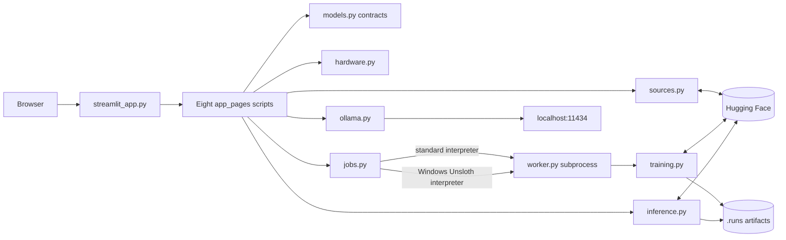
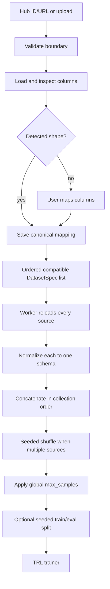
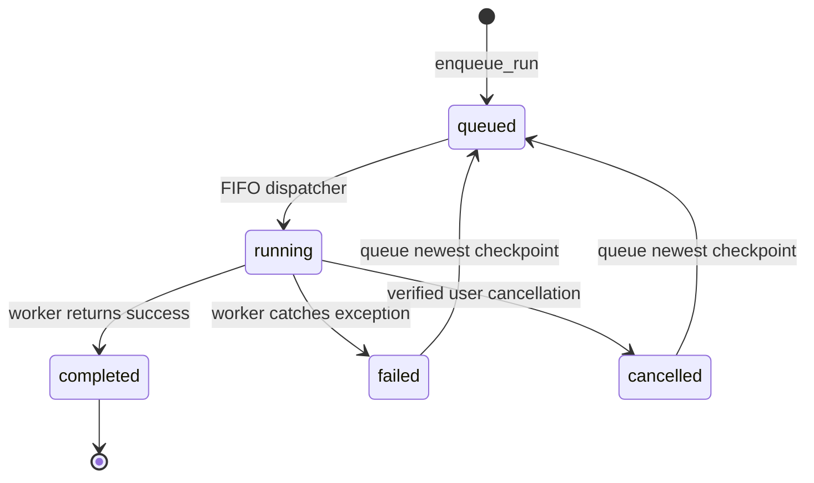

# Technical Handbook

This is the implementation reference for LoRA Fine-tune Studio `0.5.x`. It begins
with the concepts needed to understand the application and ends with the contracts,
flows, and extension points needed to maintain it.

- To install the application, use [SETUP.md](SETUP.md).
- To operate the UI, use [USAGE.md](USAGE.md).
- To contribute changes, use [CONTRIBUTING.md](CONTRIBUTING.md).
- For disclosure and deployment guidance, use [SECURITY.md](SECURITY.md).

The repository source and lockfiles are authoritative when this handbook and the code
disagree.

## 1. What the application does

LoRA Fine-tune Studio is a local Streamlit application for parameter-efficient LLM
post-training on one NVIDIA CUDA GPU. A browser session collects and validates a model,
one or more datasets, and training settings. A separate Python process performs the
training and writes its progress and artifacts to local files.

Implemented capabilities:

- Supervised Fine-Tuning (SFT), Reward Modeling, DPO, KTO, and ORPO;
- LoRA, QLoRA, OFT, and QOFT adapter methods;
- a standard Transformers/PEFT/TRL backend on Windows and Linux;
- an optional native Windows Unsloth backend for LoRA and QLoRA;
- Hugging Face datasets and uploaded CSV, JSON, or JSONL files;
- multiple compatible datasets in one run;
- durable job status, logs, cancellation, and checkpoint resume;
- optional adapter publishing to the Hugging Face Hub;
- local base-versus-adapter generation; and
- a separate playground for models already installed in Ollama; and
- a CUDA-free, read-only Streamlit showcase that renders synthetic fixtures without starting a
  worker.

Deliberate boundaries:

- training is CUDA-only and single-GPU, with one active job and a persistent local FIFO queue;
- full tuning, freeze tuning, pre-training, PPO, SimPO, and distributed training are
  not implemented;
- there is no authentication, multi-user isolation, remote/distributed queue, model registry, or
  production inference server;
- the Ollama playground does not import, merge, or run the trained adapter; and
- a saved adapter still requires its matching base model and revision.

## 2. Concepts from zero

### 2.1 Pre-training versus post-training

Pre-training teaches a model general language patterns from a very large corpus. It is
expensive and changes all or most model weights. This application starts with an
existing causal language model and performs **post-training** for a narrower behavior.

**Full tuning** updates every base-model parameter. **Parameter-efficient fine-tuning
(PEFT)** freezes the base weights and trains a much smaller adapter. The resulting
artifact is small, but it is not a standalone model.

### 2.2 Adapter methods

| Method | Base weights loaded as | Trainable addition | Practical effect |
| --- | --- | --- | --- |
| LoRA | Normal precision selected by compute type | Low-rank matrices | Lower training cost than full tuning, but the base model still consumes substantial VRAM |
| QLoRA | 4-bit NF4 | LoRA matrices | Lowest-memory LoRA path and the default recommendation |
| OFT | Normal precision selected by compute type | Orthogonal transformation parameters | Preserves hyperspherical structure rather than using low-rank additive updates |
| QOFT | 4-bit NF4 | OFT parameters | Quantized base-model memory savings with OFT adapters |

Quantization describes how frozen base weights are stored; compute type describes the
floating-point type used for calculations. QLoRA and QOFT therefore still compute in
BF16, FP16, or FP32 even though their frozen weights are stored in four bits.

### 2.3 Training approaches

| Approach | Learns from | Result in this application |
| --- | --- | --- |
| Supervised Fine-Tuning | Desired text or conversations | A causal-LM adapter that imitates demonstrated responses |
| Reward Modeling | Prompt plus preferred and rejected responses | A sequence-classification adapter that scores response quality |
| DPO | Preferred and rejected responses | A causal-LM adapter optimized directly toward the preferred response |
| KTO | Preference examples | A causal-LM adapter trained with KTO's preference objective; this app requires batch size 2 or greater |
| ORPO | Preferred and rejected responses | A causal-LM adapter combining supervised and preference objectives |

Reward Modeling is related to preference optimization because both use preference
data. It is not another name for DPO: Reward Modeling trains an explicit scalar scorer,
whereas DPO, KTO, and ORPO update a generative policy directly. The Monitor page does
not offer text generation for reward-model runs because their output is a score.

## 3. Supported recipe matrix

The registry in `models.py` is the single source of truth for UI choices, defaults,
dataset compatibility, and validation.

| Approach | TRL trainer | Accepted canonical data | Default learning rate | Beta | Minimum batch | LoRA | QLoRA | OFT | QOFT |
| --- | --- | --- | ---: | --- | ---: | :---: | :---: | :---: | :---: |
| Supervised Fine-Tuning | `SFTTrainer` | `messages`, `text`, `prompt_completion` | `2e-4` | No | 1 | Yes | Yes | Yes | Yes |
| Reward Modeling | `RewardTrainer` | `preference` | `1e-3` | No | 1 | Yes | Yes | Yes | Yes |
| DPO | `DPOTrainer` | `preference` | `1e-5` | Yes | 1 | Yes | Yes | Yes | Yes |
| KTO | `KTOTrainer` | `preference` | `1e-5` | Yes | 2 | Yes | Yes | Yes | Yes |
| ORPO | `ORPOTrainer` | `preference` | `1e-5` | Yes | 1 | Yes | Yes | Yes | Yes |

The standard backend supports every cell in the table. Unsloth is an acceleration
backend, not a fifth adapter method: it is available only for LoRA or QLoRA with BF16
or FP16 compute on native Windows.

## 4. System architecture



The architecture has four practical layers:

1. **Presentation:** `streamlit_app.py` and `app_pages/` render widgets and keep
   per-browser-session draft state.
2. **Contracts and boundaries:** `models.py`, `sources.py`, `hardware.py`, and
   `unsloth_runtime.py` validate values crossing UI, filesystem, network, and process
   boundaries.
3. **Job control:** `jobs.py`, `worker.py`, and `lifecycle.py` isolate long work from
   Streamlit reruns and manage application shutdown.
4. **ML execution:** `training.py` and `inference.py` use Datasets, Transformers, PEFT,
   TRL, bitsandbytes, PyTorch, and optionally Unsloth.

The application deliberately uses JSON files, an atomically updated local queue manifest, and one
GPU worker instead of a database or message broker. This keeps local operation inspectable and
recoverable.

`demo/streamlit_app.py` is a separate Streamlit entry point. It reads
`demo/fixtures/showcase.json`, validates that payload against `TrainingConfig` and `JobStatus` in
tests, and never imports the job manager, worker, Hugging Face clients, or CUDA stack.

## 5. Repository map

| Path | Responsibility |
| --- | --- |
| `streamlit_app.py` | Streamlit configuration, shared session state, token fallback, navigation, and shutdown control |
| `app_pages/` | System, dataset, model, GPU memory, training, review, monitor, and Ollama UI scripts |
| `src/lora_finetune_studio/models.py` | Enums, dataclasses, recipes, presets, validation, serialization, and safe run paths |
| `src/lora_finetune_studio/sources.py` | Hugging Face repository parsing, tokens, metadata, uploads, loading, and inspection |
| `src/lora_finetune_studio/hardware.py` | Read-only runtime inventory, CUDA detection, memory statistics, and model-size guidance |
| `src/lora_finetune_studio/jobs.py` | Atomic run files, worker launch, ownership checks, cancellation, resume, and log tails |
| `src/lora_finetune_studio/worker.py` | Child-process entry point and terminal job-state handling |
| `src/lora_finetune_studio/training.py` | Dataset normalization, model construction, trainer selection, training, evaluation, and publishing |
| `src/lora_finetune_studio/inference.py` | Sequential four-bit base and adapter comparison |
| `src/lora_finetune_studio/ollama.py` | Dependency-free client for two local Ollama HTTP endpoints |
| `src/lora_finetune_studio/unsloth_runtime.py` | Discovery and version check for `.venv-unsloth` |
| `src/lora_finetune_studio/lifecycle.py` | Delayed Streamlit process exit |
| `src/lora_finetune_studio/cli.py` | Installed `lora-finetune-studio` console entry point |
| `src/lora_finetune_studio/queue_dispatcher.py` | FIFO handoff after a terminal job |
| `demo/` | Isolated read-only showcase entry point, fixture, and Community Cloud requirements |
| `scripts/build_tutorial.py` | Handbook website and PDF builder, with portable `--check` comparison |
| `tests/` | CPU-safe contract, boundary, UI-startup, showcase, tutorial, and orchestration tests |
| `unsloth-runtime/` | Independent Windows Unsloth project and lockfile |

`.uploads/`, `.runs/`, `.venv/`, `.venv-unsloth/`, and
`unsloth_compiled_cache/` are runtime or generated state, not maintained application
modules.

## 6. Runtime and dependencies

### 6.1 Two isolated Python environments

| Runtime | Platform | Python | Purpose | Lockfile |
| --- | --- | --- | --- | --- |
| Main `.venv` | Windows and Linux | `>=3.14,<3.15` | Streamlit, standard training, jobs, and inference | `uv.lock` |
| `.venv-unsloth` | Windows only | `>=3.13,<3.14` (launcher requests `3.13.13`) | Native Unsloth training worker | `unsloth-runtime/uv.lock` |

This split exists because the app runtime and pinned Unsloth stack have different
Python and PyTorch constraints. Unsloth is never imported into the main Streamlit
process. `jobs.py` selects the interpreter after reading `config.use_unsloth` and adds
the repository `src/` directory to the Unsloth worker's `PYTHONPATH`.

The Linux launcher prepares only the main environment. Consequently, Linux uses the
standard Transformers/TRL backend even though standard training remains supported.

### 6.2 Dependency roles

`pyproject.toml` declares compatible ranges; `uv.lock` records the exact reproducible
resolution. The current root lock resolves the direct runtime stack to Accelerate
`1.14.0`, bitsandbytes `0.50.0`, Datasets `4.8.5`, huggingface-hub `1.27.0`, PEFT
`0.20.0`, psutil `7.2.2`, Streamlit `1.61.1`, PyTorch `2.13.0+cu130`, Transformers
`5.15.0`, and TRL `0.29.1`. The Unsloth project pins PyTorch `2.10.0`, torchvision
`0.25.0`, torchao `0.16.0`, and `unsloth[cu130-torch2100]` `2026.8.15`.

| Package | Role |
| --- | --- |
| PyTorch | CUDA tensors, models, mixed precision, allocator statistics, and training runtime |
| Transformers | Model/tokenizer loading, quantization configuration, callbacks, and generation |
| Datasets | Hub/local loading, mapping, concatenation, shuffling, and train/test splitting |
| PEFT | LoRA/OFT configuration, adapter injection, saving, and inference attachment |
| TRL | Approach-specific trainer and argument classes |
| bitsandbytes | Four-bit NF4 loading and Unsloth's eight-bit optimizer path |
| Accelerate | Device and distributed primitives used below the trainer layer |
| Streamlit | Multipage UI, forms, session state, fragments, and secrets |
| psutil | Process identity, liveness, cancellation, RAM, and system information |
| Unsloth | Optional optimized model loading, adapter injection, checkpointing, and trainer patches |

The PyTorch package is sourced from the explicit CUDA 13.0 wheel index. Both launchers
use `uv sync --locked`, so a stale lockfile fails instead of being silently updated.

### 6.3 Startup paths

The Windows launcher:

1. verifies it is beside the required project files;
2. finds or installs user-local `uv`;
3. synchronizes the root Python 3.14 environment without development dependencies;
4. synchronizes the Python 3.13.13 Unsloth environment;
5. refuses to take port `8504` from an unrelated process;
6. starts hidden `pythonw.exe -m streamlit` with logs in `.runs/`;
7. waits up to 90 seconds for `/_stcore/health`; and
8. opens the browser only after the health check succeeds.

The Linux launcher performs the equivalent root sync and health check, tracks the
Streamlit PID in `.runs/streamlit.pid`, and uses `xdg-open` when available. The console
entry point calls Streamlit directly and does not perform the launcher preparation.

The showcase is a third startup path: `uvx --from streamlit==1.61.1 streamlit run
demo/streamlit_app.py`. It does not run a launcher, create `.venv`, or listen only on
the production port convention. Community Cloud should use that file plus
`demo/requirements.txt`, not `streamlit_app.py`.

`.streamlit/config.toml` supplies the dark theme and a 200 MB server upload limit.

## 7. Streamlit execution model

Streamlit reruns the entry script and selected page from top to bottom after relevant
interactions. The entry point therefore initializes shared state before calling
`st.navigation`, and page scripts remain direct scripts rather than application
controllers.

The eight sidebar pages are:

1. System — runtime, GPU, software, Unsloth, and token readiness;
2. Dataset — source inspection, mapping, and the ordered dataset collection;
3. Model — model ID/revision validation and parameter-count inspection;
4. GPU memory — live allocator figures and safe cache cleanup;
5. Training — linked approach/method choices and trainer settings;
6. Review & run — effective configuration, blockers, and FIFO submission;
7. Monitor — queue order, two-second status polling, logs, cancellation, resume, and evaluation;
8. Ollama playground — chat with an already-installed local Ollama model.

Important session-state groups:

| Group | Representative keys | Lifetime and role |
| --- | --- | --- |
| Dataset draft | `dataset_specs`, `dataset_inspections`, `pending_dataset_*` | Current browser session; supports add/edit/remove before saving training settings |
| Model draft | `model_id`, `model_revision`, `model_parameters`, `model_ready` | Current browser session; records successful inspection |
| Training draft | `training_approach`, `training_peft_mode`, control modes, `training_config` | Current browser session; `training_config` is the validated snapshot used by Review |
| Runtime | `hardware_profile`, `run_id` | Cached initial hardware recommendation and selected durable run |
| UI-only | `ollama_messages`, warning acknowledgement, shutdown confirmation | Current browser session only |

The session state is not durable storage. `config.json`, `status.json`, checkpoints, and
logs are the durable job record. The entry point contains a compatibility migration
from the previous single `dataset_spec`/`inspection` session shape to lists.

Changing an approach resets its learning rate to the recipe default and ensures the
selected method and minimum batch size remain valid. Selecting OFT, QOFT, or FP32
disables Unsloth. Saving the form creates a new immutable-in-practice `TrainingConfig`
snapshot; later widget changes do not alter that saved object until the user saves
again.

## 8. Shared data contracts

`models.py` is the JSON process boundary. Values created by the UI must serialize to
`config.json` and reconstruct inside either worker interpreter.

### 8.1 `DatasetSpec`

| Field | Default | Meaning |
| --- | --- | --- |
| `source` | Required | `hub` or `upload` |
| `repo_id` | `None` | Hub `owner/name` for a remote source |
| `local_path` | `None` | Absolute path returned by the upload store |
| `config_name` | `None` | Optional Hugging Face dataset subset/configuration |
| `split` | `train` | Requested Hub split; uploads always load their local file as `train` |
| `format` | `auto` | Saved canonical format after inspection/mapping |
| `text_column` | `None` | Source column mapped to `text` |
| `prompt_column` | `None` | Source column mapped to `prompt` |
| `completion_column` | `None` | Source column mapped to `completion` |
| `chosen_column` | `None` | Source column mapped to `chosen` |
| `rejected_column` | `None` | Source column mapped to `rejected` |

`auto` and `needs_mapping` are inspection states, not trainable saved formats.

### 8.2 `TrainingConfig`

| Field | Default | Validation or behavior |
| --- | --- | --- |
| `model_id` | Required | Non-empty Hugging Face model repository |
| `model_revision` | `main` | Passed to model and tokenizer loading |
| `datasets` | Empty list | At least one unique, mapped, mutually compatible source |
| `approach` | SFT | Must exist in the recipe registry |
| `peft_mode` | QLoRA | Must be supported by the selected recipe |
| `use_unsloth` | `False` | Only LoRA/QLoRA; cannot use FP32 |
| `compute_type` | Auto | Auto, BF16, FP16, or FP32 |
| `preset` | Standard | Smoke test, Standard, or Quality |
| `output_dir` | Empty | Replaced during enqueue with the run's absolute output path |
| `max_length` | `1024` | Inclusive range `128..8192` |
| `epochs` | `2.0` | Greater than zero and at most 20 |
| `max_steps` | `-1` | `-1` means epoch-driven; Smoke uses 20 |
| `max_samples` | `None` | `None` means all; otherwise a positive integer global cap |
| `learning_rate` | `2e-4` | Inclusive range `1e-7..1e-2`; UI recipe default may differ |
| `beta` | `0.1` | Must be positive for DPO, KTO, and ORPO |
| `batch_size` | `1` | Must meet recipe minimum; KTO requires at least 2 |
| `gradient_accumulation_steps` | `8` | Trainer accumulation interval |
| `max_grad_norm` | `1.0` | Finite and non-negative; zero disables clipping |
| `gradient_checkpointing` | `True` | Trades recomputation for reduced activation memory |
| `eval_enabled` | `True` | Evaluation also requires at least ten combined rows |
| `eval_ratio` | `0.1` | Seeded test fraction when evaluation is created |
| `seed` | `42` | Dataset shuffle, split, and Unsloth adapter random state |
| `push_to_hub` | `False` | Requires `hub_model_id` and a token at review time |
| `hub_model_id` | `None` | Destination adapter repository |
| `resume_from_checkpoint` | `None` | Set internally to the newest checkpoint on resume |

Deserialization supplies defaults for fields introduced after the first format and
migrates the legacy singular `dataset` object into a one-item `datasets` list. This
keeps older run configurations resumable.

Dataset validation also rejects duplicate identities. An identity consists of source
type, repository ID, local path, configuration name, and split. All datasets must use
the same canonical format, and mapped columns that play different roles must be
distinct.

### 8.3 Presets

| Preset | Length | Epochs | Maximum steps | Maximum samples | Accumulation | Evaluation |
| --- | ---: | ---: | ---: | ---: | ---: | --- |
| Smoke test | 512 | 1 | 20 | 100 | 4 | Off |
| Standard | 1024 | 2 | Unlimited | Unlimited | 8 | On |
| Quality | 2048 | 3 | Unlimited | Unlimited | 16 | On |

Preset selection supplies defaults, not a new trainer. The UI exposes independent
Default/Custom controls for learning rate, epochs, maximum samples, and maximum
gradient norm. Advanced mode exposes sequence length, beta when relevant, per-device
batch size, accumulation, and gradient checkpointing.

### 8.4 `JobStatus`

| Field | Meaning |
| --- | --- |
| `state` | `queued`, `running`, `completed`, `failed`, or `cancelled` |
| `message` | Human-readable current phase |
| `progress` | Best-effort `0.0..1.0` trainer progress; Monitor renders a rounded percentage |
| `pid` | Worker PID used for liveness and ownership checks |
| `metrics` | Latest numeric trainer log or final metrics |
| `error` | Redacted terminal failure message |
| `artifact_dir` | Absolute run output directory |

## 9. Dataset pipeline



### 9.1 Network and upload boundaries

Remote inputs accept `owner/name` or a root HTTPS URL on `huggingface.co`. Parsing
rejects non-HTTPS URLs, other hosts, nested file or revision paths, query strings,
fragments, and dataset URLs supplied where a model is expected.

Uploads accept `.csv`, `.json`, and `.jsonl` only, with a 200 MB application limit.
`save_upload` ignores the supplied basename for storage, hashes the bytes with SHA-256,
and writes `.uploads/<first-16-hex-digits>.<suffix>`. Identical content is reused. The
worker resolves the saved path, requires a regular file, checks its extension again,
and selects either the Datasets `csv` or `json` loader.

### 9.2 Detection and canonical shapes

Detection runs in this priority order:

1. `prompt`, `chosen`, and `rejected` becomes `preference`;
2. `messages` becomes `messages`;
3. `text` becomes `text`;
4. `prompt` plus `completion` becomes `prompt_completion`;
5. anything else becomes `needs_mapping`.

Canonical records are:

```json
{"text": "A complete training example"}
```

```json
{"prompt": "Question", "completion": "Desired answer"}
```

```json
{"prompt": "Question", "chosen": "Preferred answer", "rejected": "Inferior answer"}
```

```json
{"messages": [{"role": "user", "content": "Question"}, {"role": "assistant", "content": "Answer"}]}
```

The worker drops unrelated columns while normalizing. For `messages`, SFT applies the
selected tokenizer's chat template with no generation prompt. Value-level semantic
validation is delegated to Datasets, the tokenizer, and the selected TRL trainer; the
application primarily validates source and column structure.

### 9.3 Multiple datasets and sampling

Each source is loaded and normalized independently so failures can name the source
position and label. The normalized datasets are concatenated rather than interleaved
or balanced. A source therefore contributes in proportion to its row count.

With multiple sources, the combined dataset is shuffled with `seed` before applying
the global sample cap. With one source, it is shuffled only when truncation is needed.
Every selected row appears once per epoch. There is no oversampling or per-source
weight control.

Evaluation is skipped when disabled by the preset or when fewer than ten rows remain.
Otherwise `train_test_split(test_size=eval_ratio, seed=seed)` creates the two datasets.

## 10. Training pipeline

The child worker executes these stages in order:

1. deserialize and validate `TrainingConfig`;
2. require a CUDA device;
3. install the QOFT compatibility bridge or Unsloth trainer patch when needed;
4. load, normalize, combine, cap, and split datasets;
5. resolve the compute dtype;
6. load tokenizer and base model;
7. construct the adapter configuration;
8. select TRL argument and trainer classes;
9. train or resume, while persisting callback status;
10. save adapter and tokenizer;
11. evaluate when an evaluation dataset exists;
12. write metrics and the resolved training configuration; and
13. optionally push adapter and tokenizer to the Hub.

### 10.1 Compute type

| Request | Effective dtype |
| --- | --- |
| Auto | BF16 when `torch.cuda.is_bf16_supported()`, otherwise FP16 |
| BF16 | BF16 when supported, otherwise FP16 |
| FP16 | FP16 |
| FP32 | FP32, standard backend only |

The fallback for an explicitly requested but unsupported BF16 value is intentional and
is shown on Review as the effective compute type. FP32 usually needs substantially more
VRAM and does not use Unsloth optimized kernels.

### 10.2 Quantization and adapter construction

QLoRA and QOFT create `BitsAndBytesConfig` with four-bit loading, NF4 quantization,
double quantization, and the effective compute dtype. Quantized models are placed on
the current CUDA device.

The standard LoRA configuration uses causal-LM or sequence-classification task type,
rank 16, alpha 32, dropout `0.05`, no bias, and all linear target modules. OFT uses
block size 32, Cayley-Neumann transformations, no bias, and all linear targets. Reward
runs keep the `score` module trainable and save it with the adapter.

QOFT applies a narrow process-local bridge around PEFT 0.20's four-bit OFT dispatcher
to accept either `config` or `oft_config`. The patch is idempotent and is installed only
for QOFT runs.

### 10.3 Standard model loading

The tokenizer uses the selected model ID and revision. Reward Modeling loads
`AutoModelForSequenceClassification` with one label; all other approaches load
`AutoModelForCausalLM`. Remote repository code is disabled for both model and tokenizer,
and model loading requires safetensors. If no pad token exists, the EOS token becomes
the pad token.

The standard path passes a PEFT configuration to TRL, which performs adapter injection.

### 10.4 Unsloth model loading

The Unsloth worker imports Unsloth before importing `training.py`, preserving Unsloth's
required import order. `FastLanguageModel.from_pretrained` loads QLoRA in four bits or
LoRA in 16 bits, passes the maximum sequence length and effective dtype, disables remote
code, and uses optimized gradient checkpointing when enabled.

Generative runs then inject rank-16, alpha-32 adapters with zero dropout into
`q_proj`, `k_proj`, `v_proj`, `o_proj`, `gate_proj`, `up_proj`, and `down_proj`.
Reward Modeling uses the shared PEFT configuration after Unsloth model loading so the
classification head is preserved. DPO and KTO invoke an Unsloth trainer patch when the
installed package exposes it.

The runtime check is cached in the Streamlit process and confirms Windows, the expected
`.venv-unsloth/Scripts/python.exe`, and an import-metadata version response within 15
seconds. Runtime availability does not guarantee that every model architecture is
supported by Unsloth.

### 10.5 TRL configuration

The app first looks for the trainer and argument class at the TRL top level and falls
back to `trl.experimental.<approach>` when necessary. Shared trainer settings include:

- configured output directory, length, epochs, maximum steps, learning rate, batch
  size, accumulation, gradient clipping, checkpointing, and seed;
- evaluation batch size 1;
- BF16/FP16 flags derived from the effective dtype;
- log every step;
- evaluate by epoch when an evaluation set exists;
- save by epoch and keep at most two checkpoints;
- disable external experiment reporting; and
- never let TRL push automatically.

SFT sets `dataset_text_field="text"`. DPO, KTO, and ORPO receive `beta`. Unsloth adds
`optim="adamw_8bit"` and `dataset_num_proc=1`. Explicit Hub publication happens only
after successful local saving and evaluation.

### 10.6 Metrics and reproducibility

`StatusCallback` persists numeric log values and computes progress from global step and
maximum steps. Monitor passes that value to the native progress bar and displays it as a rounded
whole-number percentage; it is not an ETA. The final metrics combine numeric results returned from
training with a subsequent evaluation. Exact numerical reproducibility is not guaranteed across
GPU, driver, CUDA, library, model, or kernel changes, even with the same seed.

## 11. Job lifecycle and persistence



`enqueue_run` creates a random 12-character hexadecimal ID, sets the absolute output directory,
writes `config.json` and `status.json`, appends the ID to `queue.json`, and dispatches immediately
only when no worker is active. OS file locking serializes queue changes across Streamlit, workers,
and handoff processes. Invalid, duplicate, missing, and terminal queue entries are removed while
orphaned valid queued statuses are recovered in filesystem order.

Atomic writes use a temporary file in the destination directory followed by
`os.replace`, preventing readers from observing partially written JSON. The monitor
fragment polls status every two seconds and reads only the last 12,000 log characters.

`launch_run` appends stdout and stderr to `training.log`. Standard jobs use the saved base project
interpreter; Unsloth jobs use `.venv-unsloth`. The base interpreter path is preserved across mixed
worker handoffs. Windows supplies `CREATE_NO_WINDOW`. The process starts in the current project
directory and inherits the environment, including `HF_TOKEN`.

After writing a completed or failed status, a worker starts a lightweight handoff process. The
handoff waits for the VRAM-owning worker PID to exit before dispatching the next queued run. User
cancellation also waits for termination before advancing. A dead worker is marked failed during
the next app/monitor reconciliation, and launch failures do not block later jobs.

Before cancellation, `_is_training_worker` verifies that the PID command line contains
the module worker invocation and the expected resolved configuration path. It refuses
to stop a PID that merely happens to reuse a stored number. A verified process receives
terminate, gets ten seconds to exit, and is killed only after timeout.

Resume numerically sorts `output/checkpoint-*`, writes the newest absolute path into the existing
configuration, and appends the same run ID to the queue. It fails only when no checkpoint exists.

The worker catches ordinary exceptions, removes the current token from the short error
message, writes a failed status, and sends the full traceback to `training.log`. The
traceback may contain third-party diagnostic context, so logs should still be treated
as potentially sensitive operational data.

## 12. Storage and artifacts

```text
.uploads/
└── <content-hash>.<csv|json|jsonl>

.runs/
├── streamlit.out.log
├── streamlit.err.log
├── streamlit.pid                 # Linux launcher only
├── queue.json                    # Durable FIFO run IDs
├── .queue.lock                   # Cross-process queue serialization
└── <run-id>/
    ├── config.json               # Durable launch/resume contract
    ├── status.json               # Atomic current job state
    ├── training.log              # Worker stdout and stderr
    └── output/
        ├── checkpoint-*/         # At most two trainer checkpoints
        ├── adapter/              # PEFT weights/config and tokenizer
        ├── metrics.json          # Final numeric metrics
        └── training_config.json  # Configuration used for the run
```

The adapter directory normally contains `adapter_model.safetensors`,
`adapter_config.json`, tokenizer files, and trainer-produced metadata. These files do
not include the full frozen base model. Moving an adapter between machines also
requires access to the same base model ID and compatible revision.

`config.json` and `training_config.json` contain repository IDs and local dataset paths
but not the Hugging Face token. Generated files are local runtime state and should not
be committed.

## 13. Hardware and memory behavior

`detect_hardware` inspects CUDA device 0, total VRAM, system RAM, free workspace disk,
and BF16 support. Its conservative model-size recommendation is:

| Total VRAM | Recommended method | Approximate maximum model size |
| ---: | --- | ---: |
| Below 6 GB | QLoRA | 1B |
| 6 to below 10 GB | QLoRA | 3B |
| 10 to below 16 GB | QLoRA | 7B |
| 16 GB or more | QLoRA | 13B |

These are warnings, not capacity guarantees. Architecture, sequence length, batch size,
optimizer state, checkpointing, kernel workspace, fragmentation, and other GPU
processes all affect real usage. The System page additionally requires 3.5 GB of
currently free VRAM before reporting basic QLoRA readiness.

`cuda_memory_stats` distinguishes global free/total VRAM from PyTorch process-local
allocated/reserved memory. Cleanup calls Python garbage collection and
`torch.cuda.empty_cache()`. It cannot release live tensors, memory held by the isolated
worker, Ollama allocations, or memory owned by unrelated programs, so the UI disables
cleanup while a training run is active.

## 14. Post-training inference

For generative approaches, Monitor can compare the base model and trained adapter. Each
call loads the base model in four-bit NF4, chooses BF16 when supported and FP16
otherwise, tokenizes the prompt, and performs deterministic generation with
`do_sample=False` and 128 new tokens by default. The adapter call attaches
`PeftModel.from_pretrained` before generation.

Base and adapter generation run sequentially rather than keeping two models resident.
Cleanup occurs in `finally`, including failed loads or generations. Remote model code
is disabled and safetensors are required. Reward-model adapters are excluded because
the current comparison interface generates text rather than displaying scalar scores.

The Ollama playground is independent. Its standard-library client sends:

- `GET http://localhost:11434/api/tags` with a five-second timeout; and
- `POST http://localhost:11434/api/generate` with `stream=false` and a 120-second
  timeout.

It does not send Hugging Face credentials or inspect `.runs/`.

## 15. Credentials, network, and trust boundaries

### 15.1 Hugging Face token

`HF_TOKEN` is read from the process environment. If absent, the Streamlit entry point
can read `st.secrets["HF_TOKEN"]` and place it into the process environment so child
workers inherit it. The Windows launcher can also import the persistent user-level
Windows variable without printing it.

Tokens are never fields in `TrainingConfig`, status files, or output configuration.
The System page reveals only whether a token exists and, on an explicit verification
click, the returned account identity. Worker short errors replace the exact token with
`[REDACTED]`.

### 15.2 Network destinations

Depending on the chosen workflow, the application can contact:

- Astral's official installer when a launcher cannot find `uv`;
- Hugging Face API and repository hosts for identity, metadata, datasets, models, and
  optional adapter publication; and
- `localhost:11434` for optional Ollama requests.

Streamlit itself listens on local port `8504` when started by the provided launchers.
The project has no application authentication and should not be exposed as a shared
network service without an external security layer.

### 15.3 Filesystem and code trust

- Run IDs accept only lowercase ASCII letters, digits, and hyphens before joining the
  `.runs` root.
- Upload filenames cannot select their stored path.
- Hub repository URLs are restricted to root repository locations.
- Model and tokenizer loading use `trust_remote_code=False`.
- Standard model and inference loading require safetensors.
- Process termination verifies ownership by command line and configuration path.

Dataset contents, model files, pickle-bearing trainer checkpoints, generated logs, and
third-party packages remain inputs that require normal supply-chain and local-data
caution. See [SECURITY.md](SECURITY.md) for supported versions and reporting.

## 16. Failure behavior and troubleshooting map

| Symptom | Boundary to inspect | Primary evidence |
| --- | --- | --- |
| Launcher does not open the app | Environment sync, port, or health check | `.runs/streamlit.err.log` |
| System page reports wrong runtime | Active interpreter or CUDA wheel | System page and `uv.lock` |
| Unsloth toggle is disabled | Platform, runtime check, method, or compute type | System and Training pages |
| Dataset inspection fails | URL, token, subset, split, extension, or file shape | Dataset page error |
| Review cannot start | Saved draft, CUDA, model-size acknowledgement, token, or active run | Review blocker list |
| Training fails while loading data | Per-source reload or normalization | `training.log` and failed status |
| CUDA out of memory | Model size, length, batch, precision, or another process | GPU memory page and `training.log` |
| Resume is unavailable | No `checkpoint-*` directory | Run output directory |
| Adapter comparison fails | Base revision, adapter compatibility, VRAM, or gated access | Monitor error and server log |
| Ollama list is empty | Service stopped or no pulled models | Ollama application/service |

The UI is a client of durable job state. Closing a browser tab does not intentionally
cancel a worker. Using the sidebar Stop control does cancel the verified active worker
before scheduling Streamlit to exit; it does not stop Ollama or unrelated processes.

## 17. Testing and continuous integration

Tests are organized by boundary:

| Test module | Main coverage |
| --- | --- |
| `test_app.py` | Streamlit startup, pages, dataset interaction helpers, and UI contracts |
| `test_models.py` | Defaults, presets, validation, serialization, migration, and run paths |
| `test_sources.py` | Repository parsing, uploads, token helpers, inspection, and loading |
| `test_hardware.py` | Runtime scan, recommendations, warnings, and memory behavior |
| `test_jobs.py` | Atomic files, one-job ownership, launch, cancellation, logs, and resume |
| `test_training.py` | Normalization, combination, splitting, PEFT/quantization, trainers, and patches |
| `test_inference.py` | Loading, generation, adapter attachment, and cleanup |
| `test_lifecycle.py` | Delayed process-exit scheduling |
| `test_queue_dispatcher.py` | FIFO continuation after a terminal job |
| `test_queue_ui.py` | Monitor queue presentation |
| `test_demo.py` | Showcase fixture contracts and read-only Streamlit startup |
| `test_tutorial.py` | Handbook structure, portable generated-asset hashes, and local links |
| `test_worker.py` | Child-process entry behavior |

GitHub Actions runs the following on both `ubuntu-latest` and `windows-latest` with
Python 3.14:

```powershell
uv sync --group dev --group docs
uv run ruff format --check .
uv run ruff check .
uv run ty check src
uv run pytest
uv run --group docs python scripts/build_tutorial.py --check
```

`--check` rebuilds the handbook PDF in a temporary directory and compares metadata, page
dimensions, and extracted text rather than raw PDF bytes. Generated HTML, CSS, JS, and
JSON are compared after newline normalization so Windows CRLF checkouts do not fail.

The automated suite mocks expensive or external boundaries and does not prove that a
particular GPU, model architecture, dataset, or Unsloth release can finish training.
Changes to CUDA loading, quantization, adapters, trainers, or inference require a small
hardware smoke test in addition to CI.

## 18. Extension playbooks

### Add a training approach

1. Add the enum value and one `TrainingRecipe` entry.
2. Define canonical dataset requirements and validation.
3. Add its TRL config/trainer mapping and any model-class or trainer options.
4. Update UI descriptions and reward/generation behavior where relevant.
5. Add model, dataset, trainer-resolution, and configuration tests.
6. Update the compatibility table and user documentation.

Do not expose an approach merely because the installed TRL version contains a class;
the app also needs a correct data contract, model type, controls, artifacts, and tests.

### Add an adapter method

1. Extend `PeftMode` and recipe support intentionally.
2. Implement model quantization and PEFT construction.
3. Decide standard and Unsloth eligibility explicitly.
4. Add memory guidance, validation, and backend tests.
5. Document the artifact and inference requirements.

### Add a dataset shape

1. Detect it in `inspect_dataset` or require an explicit mapping.
2. Add fields to `DatasetSpec` only when the process contract needs them.
3. Validate mappings in `TrainingConfig.validate`.
4. Normalize to the trainer's minimal canonical columns.
5. Test detection, mapping, source-specific errors, combination, and legacy loading.

Inspection and normalization must change together; otherwise the UI can save a shape
the worker cannot consume.

### Add a configuration field

1. Add a JSON-serializable field and conservative default to `TrainingConfig`.
2. Add a `from_dict` default when older run files must remain resumable.
3. Validate it at the contract boundary.
4. Add the UI control and Review display.
5. Pass it to the correct trainer/model boundary and add round-trip tests.

Never place credentials or non-serializable runtime objects in `TrainingConfig`.

### Add a Streamlit page

1. Create a direct UI script under `app_pages/`.
2. Register one `st.Page` in `streamlit_app.py`.
3. Initialize genuinely shared per-session state in the entry point.
4. Keep reusable or testable business logic in `src/lora_finetune_studio/`.
5. Add a startup or behavior test and document the page's boundary.

### Change job persistence

Preserve atomic status visibility, token-free configuration, process ownership checks,
legacy deserialization, and checkpoint compatibility. A database or queue would be an
architectural replacement rather than a local refactor.

## 19. Upstream references

- [Streamlit documentation](https://docs.streamlit.io/)
- [PyTorch documentation](https://docs.pytorch.org/docs/stable/)
- [Transformers documentation](https://huggingface.co/docs/transformers/)
- [Datasets documentation](https://huggingface.co/docs/datasets/)
- [PEFT documentation](https://huggingface.co/docs/peft/)
- [TRL documentation](https://huggingface.co/docs/trl/)
- [bitsandbytes documentation](https://huggingface.co/docs/bitsandbytes/)
- [Hugging Face Hub documentation](https://huggingface.co/docs/huggingface_hub/)
- [Unsloth documentation](https://docs.unsloth.ai/)
- [uv project documentation](https://docs.astral.sh/uv/concepts/projects/)
- [Ollama API documentation](https://docs.ollama.com/api/)

These links explain the underlying libraries. The exact behavior exposed by this
application is the narrower contract documented above and implemented in this
repository.
