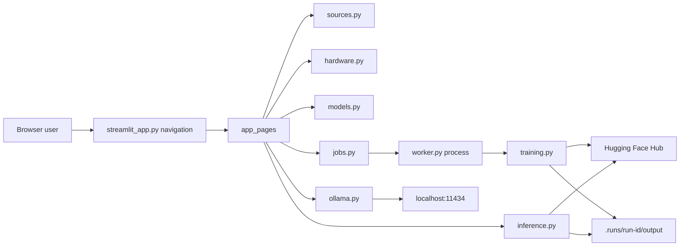
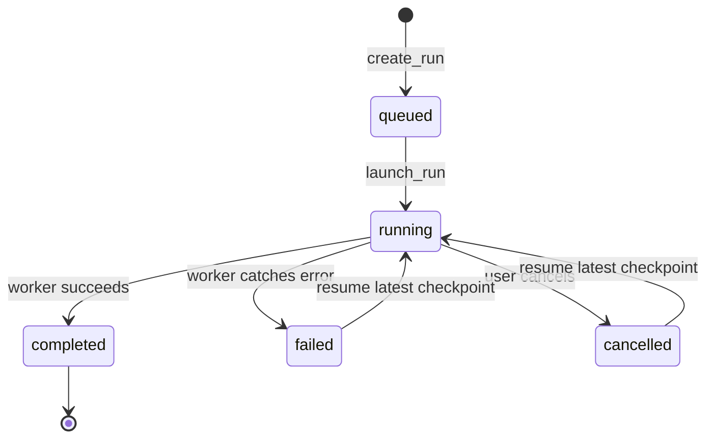

# Technical Reference

This document describes the implemented architecture of LoRA Fine-tune Studio `0.2.x`. For
operating instructions, see [USAGE.md](USAGE.md). For contribution requirements, see
[CONTRIBUTING.md](CONTRIBUTING.md).

## Goals and boundaries

The project provides a transparent local workflow for parameter-efficient post-training.
It favors inspectable files and one worker process over databases, queues, or hosted services.

Implemented:

- SFT, Reward, DPO, KTO, and ORPO trainers;
- LoRA, QLoRA, OFT, and QOFT adapters;
- Hugging Face or uploaded datasets;
- one durable local training job;
- checkpoint cancellation and resume;
- local base-versus-adapter comparison; and
- an independent Ollama playground.

Not implemented:

- PPO, full tuning, freeze tuning, or distributed training;
- CPU training or multi-GPU orchestration;
- multi-user access, authentication, quotas, or remote job execution;
- model registry, production serving, or adapter conversion for Ollama.

## Runtime architecture



The entrypoint initializes shared session state and native sidebar navigation. Eight direct page
scripts own their focused UI. Long-running training is isolated in a child Python process; pages
and the worker exchange serializable configuration and status through the run directory.

## Module map

| Module | Responsibility |
| --- | --- |
| `streamlit_app.py` | Page configuration, shared session initialization, token fallback, and sidebar navigation |
| `app_pages/` | System, dataset, model, GPU memory, training, review, monitor, and Ollama page scripts |
| `models.py` | Shared enums and dataclasses for hardware, datasets, training, job status, presets, and run paths |
| `sources.py` | Token access, Hugging Face URL validation, metadata, uploads, dataset loading, and shape inspection |
| `hardware.py` | Read-only OS/runtime/software inventory, CUDA and resource detection, memory cleanup, and conservative size guidance |
| `jobs.py` | Run creation, atomic status files, worker launch, active-job detection, cancellation, resume, and log tails |
| `worker.py` | Child-process entry point and terminal completed/failed status handling |
| `training.py` | Dataset normalization/split, model/tokenizer loading, PEFT configuration, SFT, metrics, and artifacts |
| `inference.py` | Sequential four-bit base and adapter generation for comparison |
| `ollama.py` | Small standard-library client for the local Ollama tags and generate endpoints |
| `cli.py` | Installed `lora-finetune-studio` console entry point for Streamlit |

## System readiness scan

`scan_system` reads platform metadata, logical CPU count, currently available RAM, free workspace
disk, command presence, the active virtual environment, and installed package versions. It does
not execute installers, modify drivers, or return credential values. Hugging Face status is
reduced to configured or not configured in the UI.

The UI and standard backend use CPython 3.14 in the uv-managed project `.venv` and the PyTorch
CUDA 13.0 wheel index. On Windows, `unsloth-runtime/uv.lock` supplies a separate CPython 3.13
runtime in `.venv-unsloth`. The Windows launcher synchronizes both environments; Linux retains
the standard backend.

The System page compares live free CUDA memory with a 3.5 GB minimum for the smallest supported
QLoRA jobs. This is a readiness warning rather than a guarantee: model architecture, sequence
length, batch settings, and other GPU processes still affect actual use.

## Shared contracts

`models.py` is the process boundary. Values written by the UI must round-trip through JSON and be
reconstructed by the worker.

### `DatasetSpec`

- `source`: `hub` or `upload`
- Hub fields: `repo_id`, optional `config_name`, and `split`
- Upload field: absolute `local_path`
- Format fields: `format`, `text_column`, `prompt_column`, `completion_column`, `chosen_column`,
  and `rejected_column`

### `TrainingConfig`

`datasets` is an ordered list of `DatasetSpec` values. Deserialization migrates the legacy
single `dataset` object into a one-item list so existing run configurations remain resumable.

Important defaults:

| Setting | Default |
| --- | --- |
| Model revision | `main` |
| Approach | Supervised Fine-Tuning |
| PEFT mode | QLoRA |
| Use Unsloth | Disabled in the data contract; enabled by default in the UI when available |
| Preset | Standard |
| Maximum length | 1024 |
| Epochs | 2 |
| Maximum samples | Unlimited |
| Learning rate | `2e-4` |
| Maximum gradient norm | 1.0 |
| Compute type | Auto |
| Beta | 0.1 |
| Train batch size | 1 |
| Gradient accumulation | 8 |
| Gradient checkpointing | Enabled |
| Evaluation ratio | 0.1 |
| Seed | 42 |
| Hub upload | Disabled |

Validation requires a model, at least one unique dataset source, one shared canonical dataset
format compatible with the selected recipe, sequence length from 128 through 8192, epochs above
zero and no greater than 20, a positive maximum-sample limit when present, a finite non-negative
maximum gradient norm, and a destination repository when Hub upload is enabled.

### Presets

| Preset | Length | Epochs | Steps | Samples | Accumulation | Evaluation |
| --- | ---: | ---: | ---: | ---: | ---: | --- |
| Smoke test | 512 | 1 | 20 | 100 | 4 | Off |
| Standard | 1024 | 2 | Unlimited | Unlimited | 8 | On |
| Quality | 2048 | 3 | Unlimited | Unlimited | 16 | On |

Default/Custom controls can override preset epochs and sample limits before the configuration is
saved. Preset changes restore those defaults.

## Source and dataset flow

Remote entries accept `owner/name` or an HTTPS Hugging Face repository-root URL. The parser rejects
other schemes, hosts, nested paths, query strings, and fragments. Model metadata supplies the
safetensors parameter count when available.

Uploads accept CSV, JSON, and JSONL up to 200 MB. `save_upload` hashes the content and stores it as
`.uploads/<hash>.<suffix>`, preventing a supplied filename from selecting an arbitrary path.

Inspection recognizes these shapes:

1. `prompt`, `chosen`, and `rejected`
2. `messages`
3. `text`
4. `prompt` plus `completion`
5. unknown columns requiring mapping

Before training, each source is reduced to the canonical columns for its common format. The worker
concatenates every normalized source, shuffles multiple sources with the configured seed, and then
applies `max_samples` as a global cap. This preserves every row once per epoch and makes source
contribution proportional to row count. Incompatible normalized schemas fail with the source
position in the error. Combined datasets with fewer than ten rows skip evaluation; otherwise the
configured ratio produces a seeded train/test split.

## Job lifecycle



`create_run` refuses to proceed while a stored running PID still exists. It creates a random
twelve-character run ID, assigns the output directory, and atomically writes `config.json` and the
initial `status.json`.

`launch_run` starts `python -m lora_finetune_studio.worker <config>` with output appended to
`training.log`. Standard jobs use the app interpreter. Unsloth jobs use the repository-local
Python 3.13 interpreter and receive `src` through `PYTHONPATH`. Windows uses `CREATE_NO_WINDOW`;
Linux uses the normal detached child process. The Streamlit fragment reads status every two seconds.

Cancellation first verifies that the stored PID command is this run's
`lora_finetune_studio.worker` with the expected configuration path. It then terminates the PID,
waits ten seconds, and kills it if necessary. Resume sorts `checkpoint-*` directories numerically,
stores the newest path in the existing configuration, and launches the same run again.

The global sidebar shutdown control uses the same verified cancellation path, then schedules the
Streamlit process to exit after a short delay so the final status message can render. It does not
terminate Ollama or any process outside this application boundary.

## Training implementation

Training requires `torch.cuda.is_available()`. Auto compute uses BF16 when supported and FP16
otherwise. Users can explicitly request BF16, FP16, or FP32; unsupported BF16 resolves to FP16.
FP32 uses the standard backend because Unsloth's optimized kernels require FP16 or BF16. Remote
model code is disabled, and model loading requires safetensors.

QLoRA and QOFT add a `BitsAndBytesConfig` with:

- four-bit loading;
- NF4 quantization;
- double quantization; and
- the resolved BF16, FP16, or FP32 compute type.

The standard backend uses `LoraConfig` or `OFTConfig` with all linear target modules. QOFT includes
a narrow compatibility bridge for PEFT 0.20's mismatched four-bit OFT dispatcher argument. The
Unsloth backend imports Unsloth before TRL, loads QLoRA in four-bit or LoRA in 16-bit,
and injects rank-16 adapters with alpha 32, zero dropout, optimized gradient checkpointing, and the
standard attention/MLP projections. It uses the eight-bit AdamW optimizer and one Windows dataset
process. The recipe registry selects `SFTTrainer`, `RewardTrainer`, `DPOTrainer`, `KTOTrainer`, or
`ORPOTrainer`. Reward runs load a one-label sequence-classification head and preserve `score` in
the adapter. All paths preserve the same run artifacts and retain at most two trainer checkpoints.

The status callback persists numeric metrics reported by the selected trainer.

## Storage layout

```text
.uploads/
└── <content-hash>.jsonl

.runs/<run-id>/
├── config.json
├── status.json
├── training.log
└── output/
    ├── checkpoint-*/
    ├── adapter/
    ├── metrics.json
    └── training_config.json
```

The adapter directory contains PEFT weights and tokenizer files. Loading the adapter still requires
the matching base-model ID and revision.

## Post-training inference

`generate_text` loads the base model in four-bit NF4, runs deterministic generation, and optionally
attaches `PeftModel.from_pretrained(adapter_path)`. The UI calls it separately for the base and
adapter. Cleanup runs in a `finally` block so model references and unused CUDA cache are released
after successful generation and loading or inference failures.

The GPU memory page reads global free/total VRAM with `torch.cuda.mem_get_info` and process-local allocated
and reserved memory with PyTorch's allocator metrics. Its cleanup action runs `gc.collect()` and
`torch.cuda.empty_cache()`. It does not free live tensors or CUDA memory owned by the isolated
training worker, Ollama, or unrelated processes. The action is disabled while training is active;
terminating that worker through the existing cancellation control releases its CUDA context.

The Ollama playground page is independent. It calls `GET /api/tags` and `POST /api/generate` on
`http://localhost:11434`; it neither reads the run adapter nor creates an Ollama model.

## Credentials and network boundaries

`HF_TOKEN` is read from the process environment. The Streamlit UI can fall back to the ignored
local secrets file and places the value into the process environment for downstream calls. The
Windows launcher also reads the persistent Windows user variable without printing it; Linux
inherits `HF_TOKEN` from the launching shell.

Network access may include:

- Astral's `uv` installer on first one-click launch;
- Hugging Face APIs and repository downloads;
- optional Hugging Face adapter upload; and
- optional localhost Ollama calls.

Tokens are not fields in `TrainingConfig` and therefore do not enter `config.json` or
`training_config.json`. See [SECURITY.md](SECURITY.md) for operational hardening.

## Testing and CI

Tests cover the Streamlit startup path, hardware warnings, configuration round-tripping and
validation, run-path safety, job creation, Hugging Face URL parsing, upload validation, dataset
inspection, normalization, and small-dataset splitting.

GitHub Actions runs on `windows-latest` with Python 3.14:

```powershell
uv run ruff format --check .
uv run ruff check .
uv run ty check src
uv run pytest
```

Unit tests do not perform a full GPU training job. Changes to model loading, quantization, the
trainer, or inference require an additional CUDA smoke test when hardware is available.

## Extension guidance

- Add fields to `TrainingConfig` before adding corresponding UI or trainer controls.
- Add dataset shapes at inspection and normalization boundaries together.
- Add a new training method as a separate dataset/trainer contract; do not silently overload SFT.
- Keep job state durable and token-free.
- Preserve one clear owner for each boundary and add contract tests before refactoring it.
- Document user-visible changes in README, USAGE, TECHNICAL, and CHANGELOG as appropriate.
